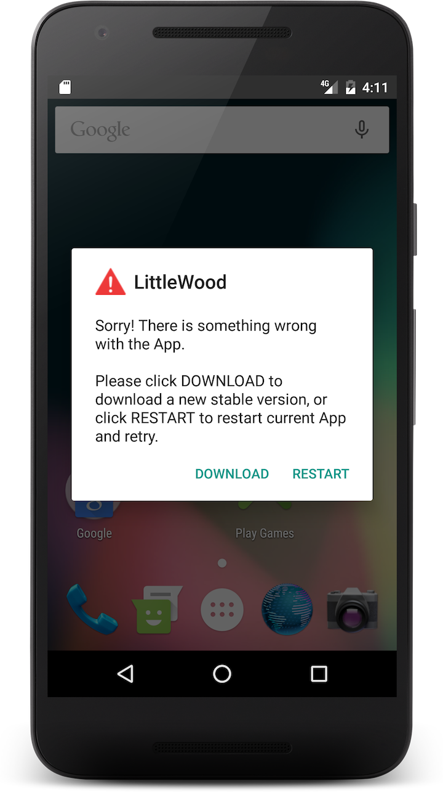
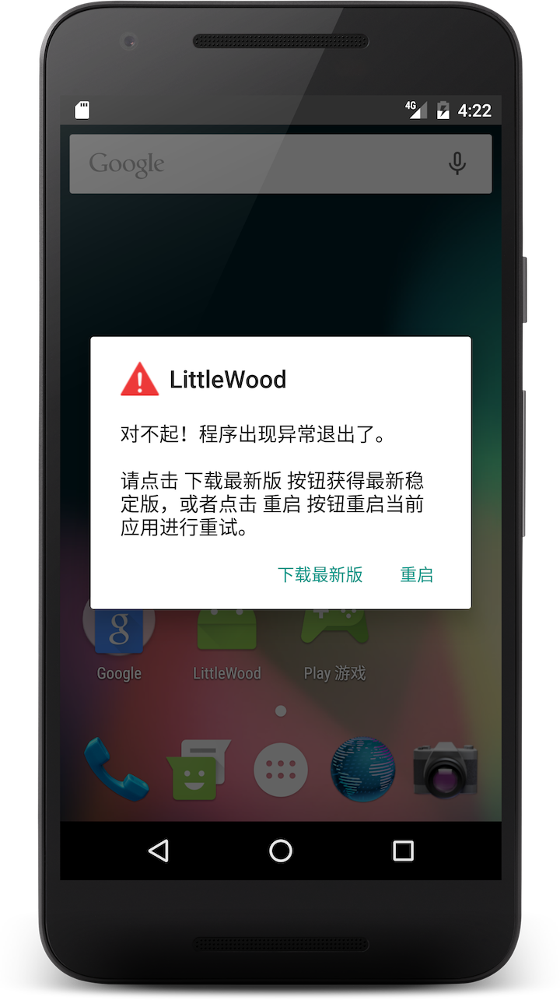
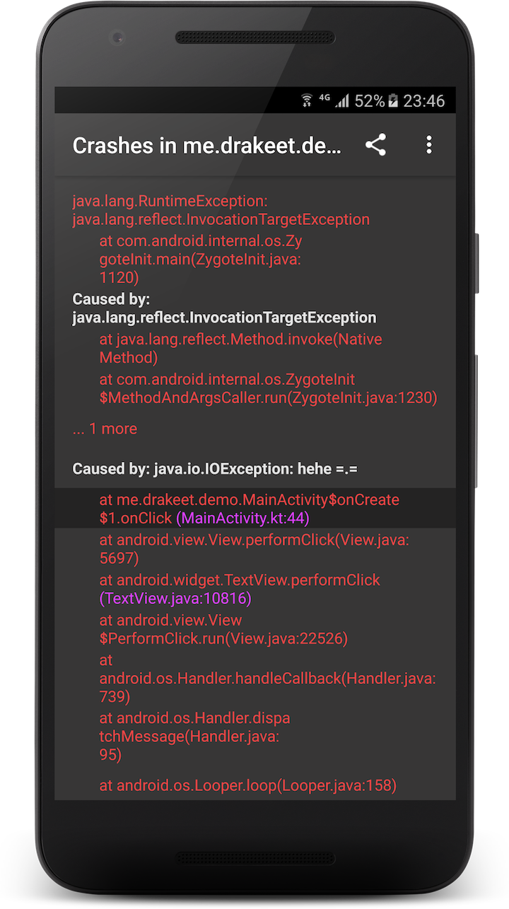

# CrashWoodpecker

[](https://maven-badges.herokuapp.com/maven-central/me.drakeet.library/crashwoodpecker)

A nice and strong uncaught exception handler library, supports showing logs both on `Logcat` & **Woodpecker** and set an `AlertDialog` to help user to download a new stable application.


## Getting started

[](https://maven-badges.herokuapp.com/maven-central/me.drakeet.library/crashwoodpecker)

In your `build.gradle`:

```gradle
dependencies {
  compile 'me.drakeet.library:crashwoodpecker:2.1.1'
}
```

In your `Application` class:

```java
public class ExampleApplication extends Application {

  @Override public void onCreate() {
    super.onCreate();
    CrashWoodpecker.instance()
        .withKeys("widget", "me.drakeet")
        .setPatchMode(PatchMode.SHOW_LOG_PAGE)
        .setPatchDialogUrlToOpen("https://drakeet.me")
        .setPassToOriginalDefaultHandler(true)
        .flyTo(this);
  }
}
```

And in your `AndroidManifest.xml` file:

```xml
<application
    android:name=".ExampleApplication" // <-- 
    ...>
    ...
</application>
```

**That is all!** CrashWoodpecker will automatically show an Activity when your app crash with uncaught exceptions including new thread exceptions in your debug build.

## Change logs

v2.1.0

https://github.com/drakeet/CrashWoodpecker/releases

 

v1.3.0

- Added `withKeys` for more highlight keys

eg. With multiple keys: packageName(default), "widget", "me.drakeet"



## TODO

* Save logs and to reload.
* Java doc.

## Thanks

Great Square: http://square.github.io

markzhai: https://github.com/markzhai

jug6ernaut: https://github.com/jug6ernaut

## About me

https://github.com/drakeet

https://drakeet.me


License
============

    The MIT License (MIT)

    Copyright (c) 2015 drakeet

    Permission is hereby granted, free of charge, to any person obtaining a copy
    of this software and associated documentation files (the "Software"), to deal
    in the Software without restriction, including without limitation the rights
    to use, copy, modify, merge, publish, distribute, sublicense, and/or sell
    copies of the Software, and to permit persons to whom the Software is
    furnished to do so, subject to the following conditions:

    The above copyright notice and this permission notice shall be included in all
    copies or substantial portions of the Software.

    THE SOFTWARE IS PROVIDED "AS IS", WITHOUT WARRANTY OF ANY KIND, EXPRESS OR
    IMPLIED, INCLUDING BUT NOT LIMITED TO THE WARRANTIES OF MERCHANTABILITY,
    FITNESS FOR A PARTICULAR PURPOSE AND NONINFRINGEMENT. IN NO EVENT SHALL THE
    AUTHORS OR COPYRIGHT HOLDERS BE LIABLE FOR ANY CLAIM, DAMAGES OR OTHER
    LIABILITY, WHETHER IN AN ACTION OF CONTRACT, TORT OR OTHERWISE, ARISING FROM,
    OUT OF OR IN CONNECTION WITH THE SOFTWARE OR THE USE OR OTHER DEALINGS IN THE
    SOFTWARE.
